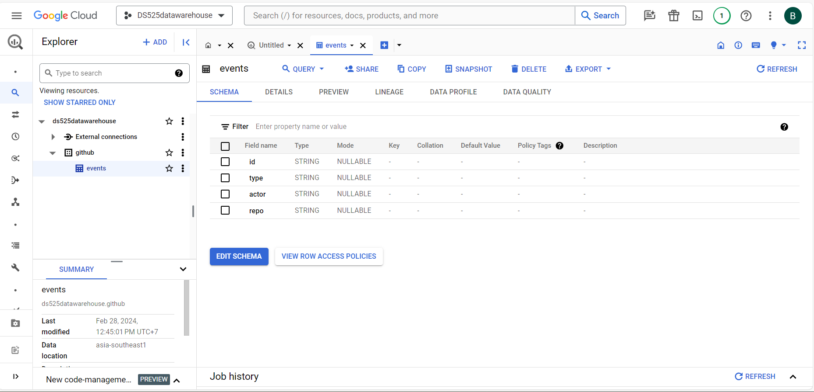
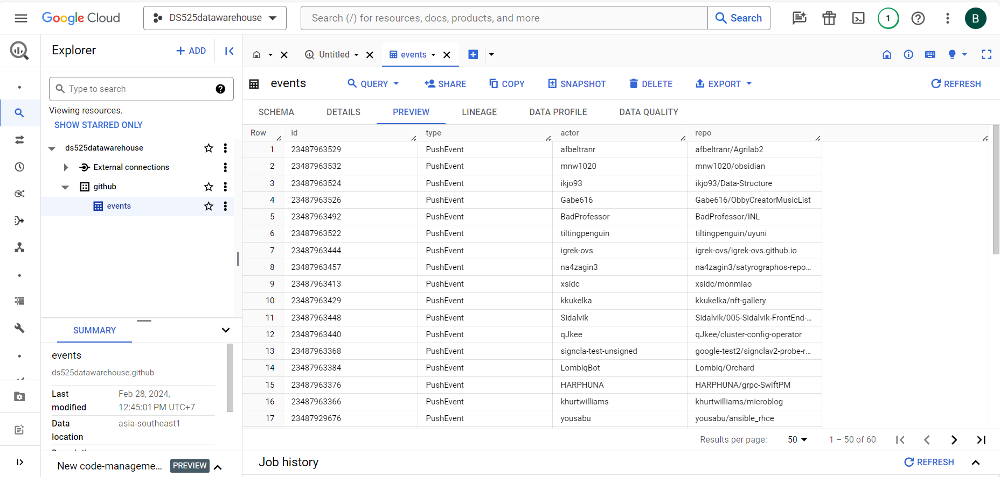

## Documentation Building a data to warehouse ##
บนหน้า google cloud 

1.ทำการสร้าง dataset บน google cloud bigquery ชื่อ github 
2.กดดู Dataset info นำ project_id = "ds525datawarehouse" มาใส่ในไฟล์ etl_bigquery.py
3.บน google cloud ให้ไปที่ IAM & admin --> service account --> create service account 
เมื่อสร้าง service account เสร็จแล้วให้กดที่ service account ที่สร้างแล้ว --> keys -> add Keys -> create new key 
-> เลือก ่json -> create ไฟล์ json จะถูก download มาเก็บในเครื่องคอมพิวเตอร์ นำไฟล์มา upload ขึ้นบน codespaces
จากนั้นนำ file_path ที่อยู่ของ file json มาใส่ในส่วน keyfile บน etl_bigquery.py

บนหน้า google cloud 

1. ทำการรัน pip install -r requirements.txt เพื่อให้รัน version python ตามที่กำหนดในไฟล์ requirements.txt
2. ทำการรัน pip install google-cloud-bigquery เพื่อติดตั้ง google-cloud-bigquery บน python 
3. ทำการรัน python etl_bigquery.py เพื่อทำการเชื่อมต่อกับ google cloud bigquery โดยดูจากข้อมูลได้ทำการออกแบบตารางโดยมีการสร้าง table events มีข้อมูลในตาราง ประกอบด้วย 4 คอลัมน์
* 1)  id (PK) เก็บ id ของ events
* 2)  type เก็บชนิดของ events 
* 3)  actor --> login 
* 4)  repo --> name

ตัวอย่างเมื่อ link ข้อมูลบน บน google cloud bigquery

## Instruction Building a data to warehouse ##
1. open file in folder Building a data to warehouse  --> cd 03-buliding-a-data-warehouse/
2. connect requirements.txt  --> python -m venv ENV
                             --> source ENV/bin/activate
                             --> $ pip install -r requirements.txt
3. installs google-cloud-bigquery for python--> $ pip install google-cloud-bigquery
4. load data in etl_bigquery.py to google cloud bigquery -->$  python etl_bigquery.py 

