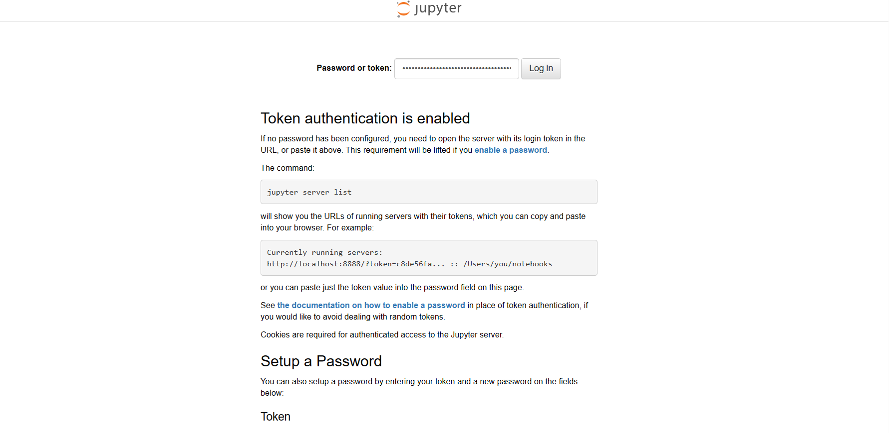
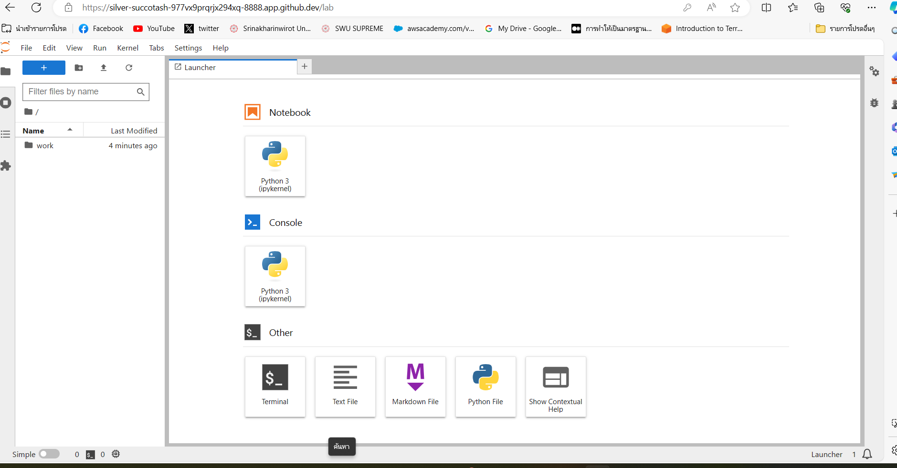
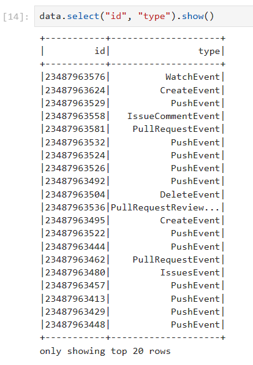
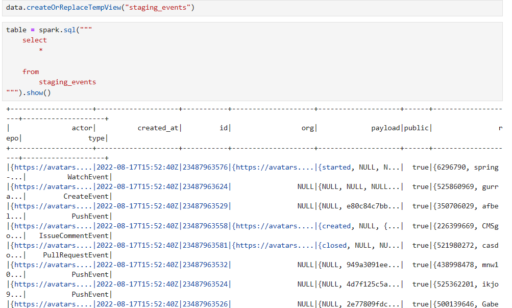

## Instruction Building a data lake ##
1. คำสั่งใช้ในการเชื่อมต่อกับ Jupyter Lab
เปิด file 04-building-a-data-lake
```sh
cd 04-building-a-data-lake/
```
ทำการเชื่อมต่อ file docker-compose.yml
```sh
docker-compose up
```
2. กด ports 8888 ตรง browser จะเชื่อมต่อไปยัง Jupyter Lab ให้นำเลข token มาใส่ เพื่อ log in เข้า

 
3.ตัวอย่างหน้าที่เชื่อมต่อกับ Jupyter Lab แล้ว



# Documentaion Building a Data Lake
เมื่อทำการเชื่อมต่อการใช้ data lake บน Jupyter Lab
## etl_local.py script
import spark เข้ามาใช้ใน python
```sh
from pyspark.sql import SparkSession
```
ทำการเชื่อมต่อ spark 
```sh
spark = SparkSession.builder \
    .appName("ETL") \
    .getOrCreate()
```
เรียกดูข้อมูลจาก file data 
```sh
data.select("id", "type").show()
```


หรือใช้คำสั่ง spark.sql แล้วเขียนเป็น sql เพื่อเรียกดูข้อมูลใน table ได้
```sh
data.createOrReplaceTempView("staging_events")
table = spark.sql("""
    select
        *
    from
        staging_events
""").show()
```


สามารถสร้าง events เพื่อเก็บข้อมูลแยกตามที่ต้องการ เช่น การสร้าง folder actor , repos เก็บข้อมูลเป็น file .csv ไว้
```sh
output_csv = "output_csv"
output_parquet = "output_parquet"
```
```sh
table.write.partitionBy("year").mode("overwrite").csv(output_csv)
```
```sh
table.write.partitionBy("date").mode("overwrite").csv(destination)
```
```sh
destination = "events"
```
```sh
table.write.partitionBy("year", "month", "day").mode("overwrite").csv(destination)
```
```sh
table.write.partitionBy("date").mode("overwrite").csv(destination)
```
เช่น folder actor ต้องการเก็บข้อมูล column  actor login , id , actor url เป็นต้น
```sh
table = spark.sql("""
    select
        actor.login
        , id as event_id
        , actor.url as actor_url
    from
        staging_events
""")
destination = "actors"
table.write.mode("overwrite").csv(destination)
```