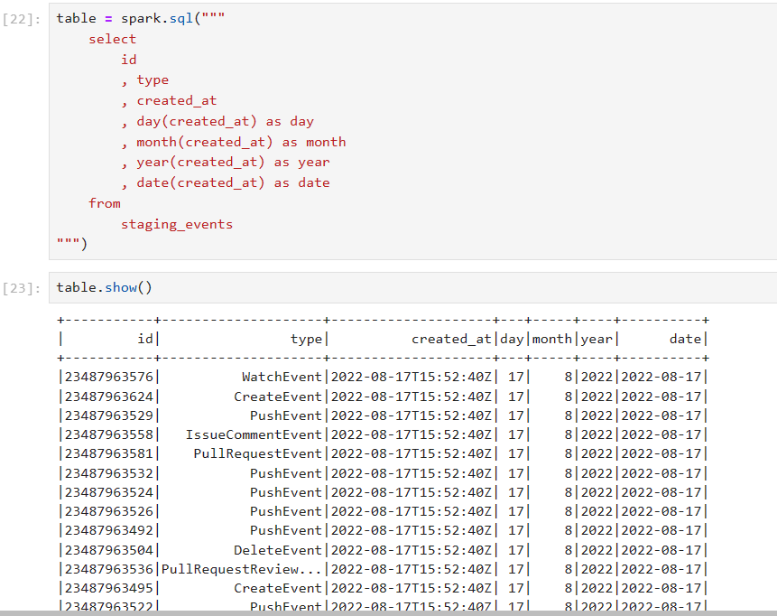

# Documentaion Building a Data Lake
ทำการเชื่อมต่อการใช้ data lake บน Jupyter Lab
## etl_local.py script
ทำการเชื่อมต่อ spark 
```sh
spark = SparkSession.builder \
    .appName("ETL") \
    .getOrCreate()
```
เรียกดูข้อมูลจาก file data 
```sh
data.select("id", "type").show()
```


หรือใช้คำสั่ง spark.sql แล้วเขียนเป็น sql เพื่อเรียกดูข้อมูลใน table ได้
```sh
table = spark.sql("""
    select
        id
        , type
        , created_at
        , day(created_at) as day
        , month(created_at) as month
        , year(created_at) as year
        , date(created_at) as date
    from
        staging_events
""")
```



## Instruction Building a data lake ##
1. คำสั่งใช้ในการเชื่อมต่อกับ Jupyter Lab
```sh
docker-compose up
```
2. กด ports 8888 ตรง browser จะเชื่อมต่อไปยัง Jupyter Lab ให้นำเลข token มาใส่ 

3.หน้าที่เชื่อมต่อกับ Jupyter Lab

